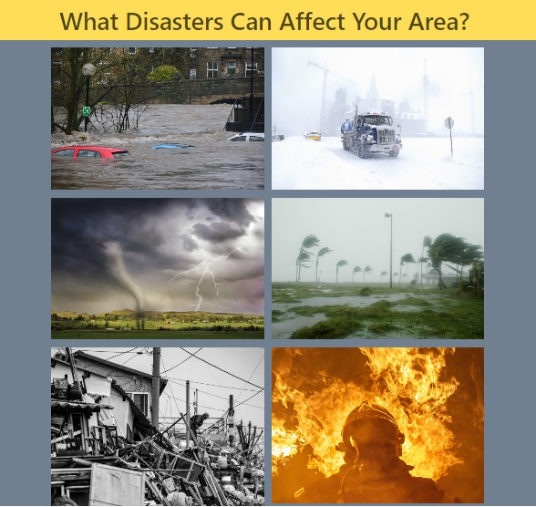

# Project_1_UA

"What Disasters Can Affect Your Area?"

## Description

This application is designed to compile external data and  provide sources to users regarding disaster relief. A sizeable amount of the population is not prepared in the event of a natural disaster. This product is designed to provide information to users who would like to prepare for natural disasters or those who have been directly affected by natural disasters. Preparation is a key component in order to reduce the impact of the of the disasters. Even without a disaster preparation plan this site is designed to provide current information regarding news, weather, and other helpful information to users who have been affected by a natural disaster. Information is provided in this application for the following disasters:
* Floods
* Blizzards
* Tornados
* Hurricanes
* Earthquakes
* Fires

## API Reference

* [Openweather](https://openweathermap.org)
* [Moment](https://momentjs.com/)
* [Currents](https://currentsapi.services/en)
* [Breezometer](https://breezometer.com/products/air-quality-api)
* [Geolocation](https://developer.mozilla.org/en-US/docs/Web/API/Geolocation_API)
* [OpenStreetMap](https://www.openstreetmap.org/)

## Credits
All photo credits are listed as comments in the html code accordingly.

## Usage 
Users have the option to click "allow" to have gelocation access their coordinates and make an API call to a server and receive a response to automatically update the weather forecast and air quality or input the name of a desired city in the search bar to update the weather forecast and air quality.

## Screenshot

## Helpful Links
* [Centers for Disease Control and Prevention](https://www.cdc.gov/disasters/index.html)
* [Department of Homeland Security Preparedness](https://www.ready.gov/)
* [Red Cross Disaster Services](https://www.redcross.org/get-help/disaster-relief-and-recovery-services.html)

